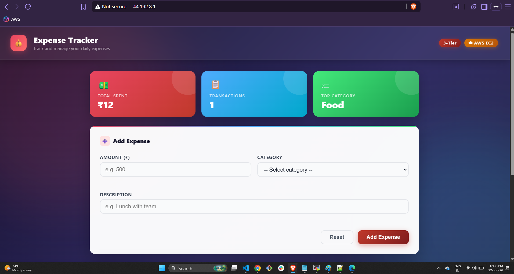
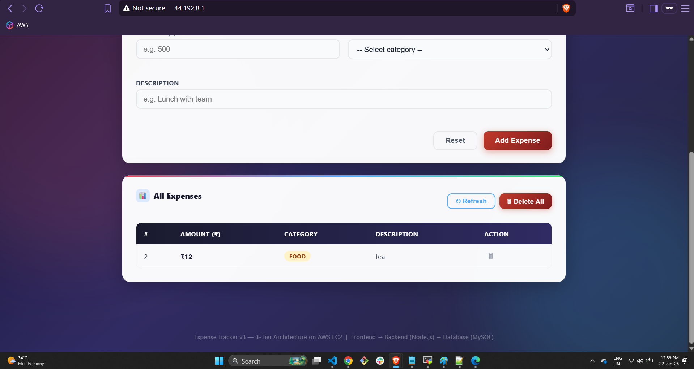
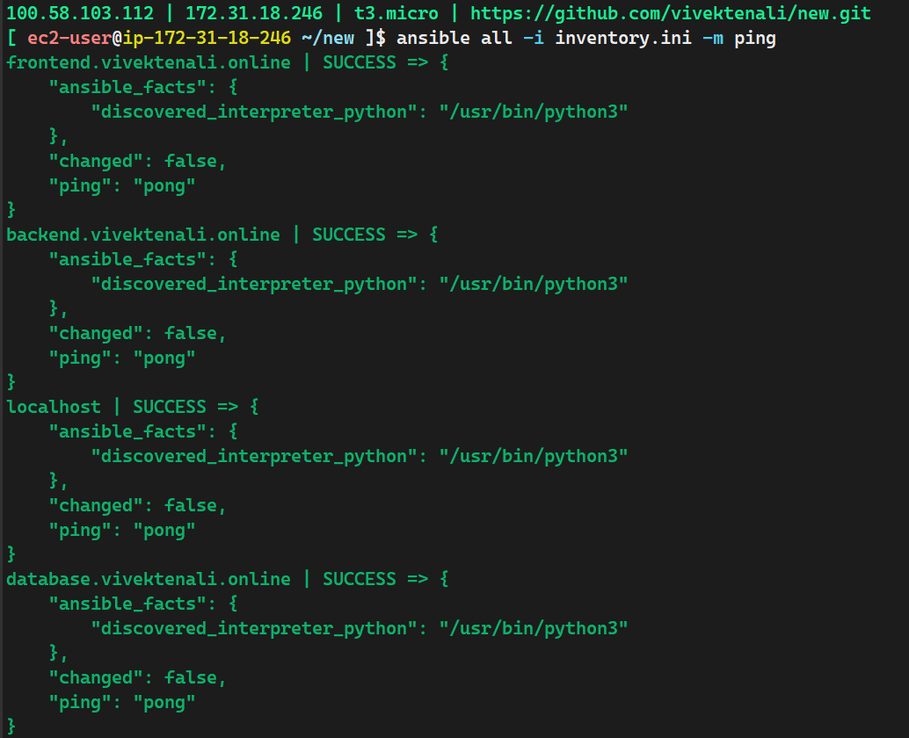

# Expense Tracker App - Ansible Automated Deployment 

A multi-tier Expense Tracker application deployed on AWS using Ansible for infrastructure provisioning and configuring application.

The application allows users to record and categorize expenses while tracking spending patterns and highlighting the highest-spending category.

Instead of manually configuring servers or running shell scripts on each machine, Ansible automates the complete deployment of all application tiers from a central control node.

## Prerequisites

- AWS Account 
- SSH access configured
- Ansible Control Node
- Route53 Hosted Zone
- Security Groups configured

## App Screenshots





## Inventory Example

[mysql]
10.0.1.10

[backend]
10.0.2.10

[frontend]
10.0.3.10


## Deployment

- Deploy individual tier:
```bash
ansible-playbook <playbook.yaml>
```
## Verification

- Check Ansible connectivity:
```bash
ansible all -i inventory.ini -m ping
```


## Ansible Concepts Used
- Inventory Management
- Playbooks
- Variables
- Templates (Jinja2)
- Privilege Escalation (become)
- Tags
- Idempotent Tasks

## Evolution of the Project
Visit [Expense-shell](https://github.com/vivektenali/Expense-shell) 

This project was initially automated using shell scripts executed on individual servers. The Ansible version improves the deployment process by providing:

- Centralized management from a control node
- Repeatable deployments
- Idempotent configuration changes
- Easier maintenance and scalability
- Better separation of infrastructure configuration and application deployment
